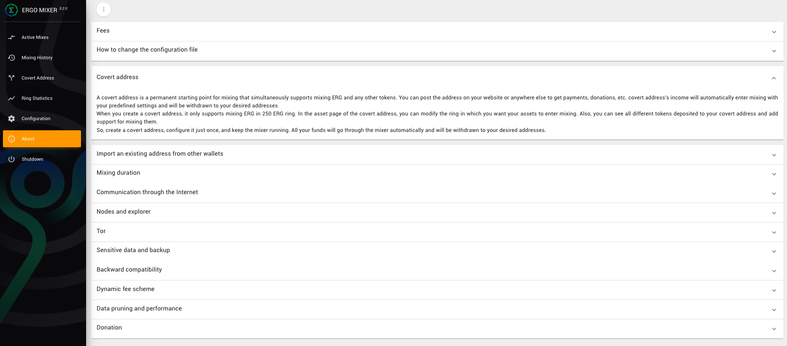

<!-- PROJECT LOGO -->
<br />
<p align="center">
  <a href="https://github.com/ergoMixer/ergoMixBack/">
    
  </a>
<!--   <h3 align="center">Calamity</h3>O -->


  <p align="center">
   Ergo Mixer
    <br />
    <a href="https://github.com/ergoMixer/ergoMixBack/wiki"><strong>Explore the docs »</strong></a>
    <br />
    <br />
    <a href="/data/demo.mp4">View Demo</a>
    ·
    <a href="https://github.com/ergoMixer/ergoMixBack/issues">Report Bug</a>
    ·
    <a href="https://github.com/ergoMixer/ergoMixBack/issues">Request Feature</a>
  </p>
</p>


<!-- TABLE OF CONTENTS -->
<details open="open">
  <summary><h2 style="display: inline-block">Table of Contents</h2></summary>
  <ol>
    <li>
      <a href="#about-the-project">About The Project</a>
      <ul>
        <li><a href="#built-with">Built With</a></li>
      </ul>
    </li>
    <li>
      <a href="#getting-started">Getting Started</a>
      <ul>
        <li><a href="#prerequisites">Prerequisites</a></li>
        <li><a href="#installation">Installation</a></li>
      </ul>
    </li>
    <li><a href="#usage">Usage</a></li>
    <li><a href="#roadmap">Roadmap</a></li>
    <li><a href="#contributing">Contributing</a></li>
    <li><a href="#license">License</a></li>
    <li><a href="#contact">Contact</a></li>
    <li><a href="#acknowledgements">Acknowledgements</a></li>
  </ol>
</details>


<!-- ABOUT THE PROJECT -->
## About The Project

ErgoMixer is a web application for mixing ergs and tokens based on Ergo platform. ErgoMixer is completely serverless; It only needs to connect to the explorer and a node (any node! no api_key is needed). For more information on how it works see [here](https://github.com/ergoMixer/ergoMixBack/wiki/How-it-works-ergoMixer).





### Built With


* [OpenJDK 8](https://jdk.java.net/java-se-ri/8-MR3)
* [SBT 1.2.7](https://www.scala-sbt.org/1.0/docs/Setup.html)
* [GraalVM](https://github.com/oracle/graal/releases) (Only required for advanced javascript features)


<!-- GETTING STARTED -->
## Getting Started

To get the Mixer up and running you have a few options:
1. <a href="#Quick-Start-Shell-Script">Quick-Start Shell Script</a> - builds from source (UNIX systems)
2. <a href="#docker-quick-start">Docker Quick Start</a>
3. <a href="#run-mixer">Download the latest `.jar`</a>
4. <a href="#Manual-Installation">Build from source</a>

### Quick Start Shell Script

Open your favourite terminal and enter the following:

    $ curl -s https://getmixer.ergonaut.space/install.sh | bash

This pulls and builds from source
    
### Docker Quick Start

To run the ErgoMixer with default config (A Node and Explorer in Mainnet network) use:
```shell
docker run -p 127.0.0.1:9000:9000 \
    --restart=always \
    -v /path/on/host/to/ergo/database_and_logfile:/home/ergo/ergoMixer \
    -d ergomixer/mixer:latest 
```

To run the ErgoMixer with a custom config file use:
```shell
docker run -p 127.0.0.1:9000:9000 \
    --restart=always \
    -v /path/on/host/to/ergo/database_and_logfile:/home/ergo/ergoMixer \
    -v <path-your-config-file>/yourConfig.conf:/home/ergo/mixer/application.conf \
    -d ergomixer/mixer:latest 
```


<!-- USAGE EXAMPLES -->
## Usage

When you open the Mixer, the home page displays information about the system and how each component works. ErgoMixer will also be available from your menu bar. 


<!-- MANUAL -->
## Manual Installation


  * #### OpenJDK 8
    Install an appropriate version of OpenJDK 8 from [Here](https://jdk.java.net/java-se-ri/8-MR3) based on your OS.
  * #### SBT 1.2.7
    Depending on your OS, you can follow instructions in [this](https://www.scala-sbt.org/1.0/docs/Setup.html) page to install sbt.

  * #### GraalVM

    #### Install GraalVM Community Edition on MacOS and Linux
    
    First you need to download an archive with the [latest release](https://github.com/oracle/graal/releases) of GraalVM (e.g.`graalvm-ce-java8-linux-amd64-19.3.1.tar.gz`) for Linux and put its content in your `$PATH` :

    ```shell
    $ cd <your/directory/with/downloaded/graal>
    $ tar -zxf graalvm-ce-java8-linux-amd64-19.3.1.tar.gz
    $ export GRAAL_HOME=<your/directory/with/downloaded/graal>/graalvm-ce-java8-19.3.1
    $ export PATH=$PATH:${GRAAL_HOME}/bin
    ```
    
    The same for MacOS:
  
    ```shell
    $ cd <your/directory/with/downloaded/graal>
    $ tar -zxf graalvm-ce-darwin-amd64-19.3.1.tar.gz
    $ export GRAAL_HOME=<your/directory/with/downloaded/graal>/graalvm-ce-java8-19.3.1/Contents/Home
    $ export PATH=$PATH:${GRAAL_HOME}/bin
    ```

  * #### Build the Appkit project
    There is a slightly modified version of appkit in this repository. So, in order to build the mixer you first need to publish appkit locally in the Ivy repository:
    ```shell
    $ cd <your_directory_clone_project>/mixer/appkit
    $ sbt publishLocal
    ```

### Build the ErgoMixer:
  * #### Frontend
      Use the following command to get the latest frontend:
      ```shell
      $ git submodule update --init
      ```
      Then build the `ergomixfront` by following [these](https://github.com/ergoMixer/ergoMixFront/blob/master/README.md) instructions.
      
      Then, use the built front in the backend by using the following command in `ergomixback` directory:
      ```shell
      $ mv ergomixfront/build/ mixer/public
      ```
  * #### Backend      
    Finally, build the backend:
    ```shell
    $ cd ../mixer
    $ sbt assembly
    ```
    The jar file will appear in `target/scala-2.12/` directory.

## Run mixer
After building the project or [downloading](https://github.com/ergoMixer/ergoMixBack/releases) jar file, to run the ErgoMixer with default config (A node and explorer in Mainnet network) use:
```shell
$ java -jar ergoMixer-*.jar
```
Also to run the ErgoMixer with a custom config file use:
```shell
$ java -jar -D"config.file"=<path-your-config>/customConfig.conf ergoMixer-*.jar
```
You can use this [config file](mixer/sample.conf) and change it as you want.

The database will be saved in your home directory. This database contains all the information and secrets being used by the mixer, So, take good care of it.

<!-- ROADMAP -->
## Roadmap

See the [open issues](https://github.com/ergoMixer/ergoMixBack/issues) for a list of proposed features (and known issues).

<!-- CONTRIBUTING -->
## Contributing

Contributions are what make the open source community such an amazing place to be learn, inspire, and create. Any contributions you make are **greatly appreciated**.

1. Fork the Project
2. Create your Feature Branch (`git checkout -b feature/AmazingFeature`)
3. Commit your Changes (`git commit -m 'Add some AmazingFeature'`)
4. Push to the Branch (`git push origin feature/AmazingFeature`)
5. Open a Pull Request


<!-- LICENSE -->
## License

Distributed under the MIT License. See `LICENSE` for more information.


<!-- MARKDOWN LINKS & IMAGES -->
<!-- https://www.markdownguide.org/basic-syntax/#reference-style-links -->
[contributors-shield]: https://img.shields.io/github/contributors/ergoMixer/ergoMixBack.svg?style=for-the-badge
[contributors-url]: https://github.com/ergoMixer/ergoMixBack/graphs/contributors
[forks-shield]: https://img.shields.io/github/forks/ergoMixer/ergoMixBack.svg?style=for-the-badge
[forks-url]: https://github.com/ergoMixer/ergoMixBack/network/members
[stars-shield]: https://img.shields.io/github/stars/ergoMixer/ergoMixBack.svg?style=for-the-badge
[stars-url]: https://github.com/ergoMixer/ergoMixBack/stargazers
[issues-shield]: https://img.shields.io/github/issues/othneildrew/Best-README-Template.svg?style=for-the-badge
[issues-url]: https://github.com/ergoMixer/ergoMixBack/issues
[license-shield]: https://img.shields.io/github/license/othneildrew/Best-README-Template.svg?style=for-the-badge
[license-url]: https://github.com/ergoMixer/ergoMixBack/blob/master/LICENSE.txt
